# Proyecto final

Integra todos los temas creando una base de datos completa con consultas y medidas de seguridad.

## Ejemplo
```sql
-- Crear esquema final
CREATE SCHEMA proyecto;
```

## Diagrama

```mermaid
graph TD;
  M[Módulos] --> P[Proyecto];
```

